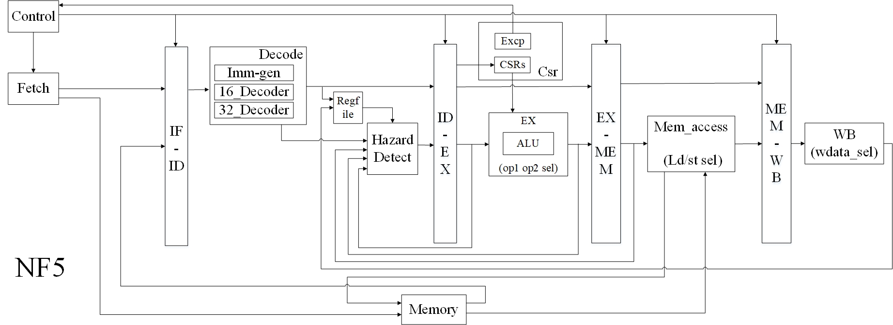

# NF5

NF5 is a simple RISC-V core with 5-stage pipeline written in verilog, and it is designed as what the book *"Computer Organization and Design The Hardware Software Interface RISC-V Edition"* described. The intention of designing NF5 is to provide a workable core of RISC-V for teaching and make a contribution to RISC-V open source community. This core implements RV32IMC of Machine-level ISA of the Privileged Architecture Version 2.0(MC) and 2.1(I). 

NF5 has passed eight riscv-isa-tests listed as follows:

|**isa-compliance-test**|**isa-function-test:**|
|------------------------|------------------------|
|`-rv32i`|`-rv32mi-p`|
|`-rv32im`|`-rv32uc-p`|
|`-rv32imc`|`-rv32ui-p`|
|`-rv32mi`|`-rv32um-p`|

NF5 has implemented 56 instructions of RISC-V ISA:

|**Type**|**Instructions**|
|--------|----------------|
|**Arithmetic**|ADD、ADDI、SUB、MUL、MULH、MULHSU、MULHU、DIV、DIVU、REM、REMU|
|**Logic**|SLL、SRL、SRA、SLLI、SRLI、SRAI、AND、OR、XOR、ANDI、ORI、XORI、SLT、SLTU、SLTI、SLTIU、LUI、AUIPC|
|**Control**|BEQ、BNE、BLT、BLTU、BGE、BGEU、JAL、JALR|
|**Memory Access**|LB、LH、LW、LBU、LHU、SB、SH、SW|
|**Privilege**|ECALL、MRET、EBREAK、WFI、FENCE、FENCE.I、CSRRW、CSRRS、CSRRC、CSRRWI、CSRRSI、CSRRCI|

## Datapath Diagram

## Table of contents
+ [Quick Start](#Quick) 
+ [What's in the NF5 repository](#What)
+ [How should I use the NF5](#How)
  + [No Gui Simulation](#Nogui)
  + [Gui Simulation](#Gui)
  + [External Assertion Test](#Assert)
  + [Synthesizing the Core](#DesignCompiler)
  + [Mapping the NF5 down to FPGA](#FPGA)
  + [Debug with GDB](#Debug)
  + [Known Issues](#Issue)
+ [Contributors](#Contributors)
## Quick Start
### OS Requirement 
  The system version we develop NF5 is Ubuntu 16.04.
### Software Requirement 
  - For open-source software, you should install iverilog and gtkwave.
  - For commercial, you should install Cadence NC-Verilog.
### Checkout the code
    $git clone https://github.com/NUDT-NF5/NF5.git
    $cd NF5
    $git submodule updata --init
### Run default test  

    $make sim_defalut
After running this, the `mySim.log` which is the result of the default test `rv32ui-p-add` will be opened with gedit. You can find `ISA_test Pass when clk = ***` in this log file at the same time. And the gtkwave will be opened after closing the gedit.
## What's in the NF5 repository
There are six main parts in NF5：
- **isa-test**
This directory includes sample testbench and two directories, which are function and compliance tests.
- **iverilog-project**
This directory includes all the scripts running with iverilog and gtkwave.
- **nc-project**
This directory includes all the scripts running with NC-Verilog.
- **output**
This directory includes `Report` and `Result` directory.`Result` is used to save self-test results as `*.txt`. `Report` is used to collect the result of all test in the chosen TVM tests as `Report_*.txt`. 
- **src**
This directory includes source codes of each module

    Unit name|Description
    ---------|-----------
    **fetch**|Fetch unit
    **decode**|Decode unit
    **execute**|Execute unit
    **memAccess**|Memory access unit
    **writeBack**|Write back unit 
    **control**|Control unit, inclued CSR unit
    **top**|Include top module Core.v and testbench TbAll.sv
    **common**|Include stage reg between every two units
- **isa_run.sh**
This script is used to generate the testbench of isa-test, which was chosen by user.

## How should I use the NF5
If you want to run a simulation, you should open a terminal in `NF5` directory firstly, then use commands listed as follows to simulate:(These commands can also be found in `Makefile` in `NF5` directory.)

Command|Description
-------|-----------
**`make sim_default`**|Running `rv32ui-p-add` test, then open gtkwave automatically
**`make sim`**|Running single or all tests in the isa-test directory
**`make sim_gui_nc`**|After running with make sim, you can open SimVision to check- out waveforms with this command
**`make sim_gui_gtk`**|After running with make sim, you can open gtkwave to checko- ut waveforms with this command
**`make clean`**|Clean all results

### No Gui Simulation
  Using command listed as follows to simulate NF5 with NC-Verilog: 
1. **make sim**
    The terminal will show `=====generate filelist=====` , then continue.
2. **Choose software environment**
    The terminal will show Software environment for simulation, choose one of them to continue.
3. **Enter Test Name and Address (1 or 2)**  
    Then you will find some tips in terminal:
    ``1  Test_name : functional-test   Test_Addr_start : 0x0000 ``
    ``2  Test_name : functional-test   Test_Addr_start : 0x8000 ``
    ``3  Test_name : compliance-test   Test_Addr_start : 0x0000 ``
    ``4  Test_name : compliance-test   Test_Addr_start : 0x8000 ``
    ``PLease input the [Number] to chose the Test Name and Address : ``
    You should input number 1 or 2 in terminal. 
    - If you enter 1, you will run founctional test and the initial test address will be 0x0000_0000. 
    - If you enter 2, the test will still be functional, but the address will be 0x8000_0000.If you enter 3 or 4, you will run compliance test, and the initial address will be the same as described in function test.
    
    Because of the PC reset value in NF5 (0x0000_0000), you should enter `1` or `3` in this step.
4. **Enter TVM model Number(function test) or Enter ISA Test Name(compliance test)**    
     Then you will find: 
     ``Please input the Number of [TVM model and Target Environment Name] to select :``
     You should enter a number listed in the terminal before each TVM model name.
     - If you are running function test, you should enter a different number according to `rv32mi-p`、`rv32uc-p`、`rv32ui-p`、`rv32um-p`. The TVM descriptions are listed as follows.
     - If you are running compliance test, you should enter a different ISA test name according to `rv32i`、`rv32im`、`rv32imc`、`rv32mi`.
   - TVM descriptions
       You can also find the following descriptions in [riscv/riscv-tests](https://github.com/riscv/riscv-tests). To allow maximum reuse of a given test, each test program is constrained to only use features of a given *test virtual machine* or TVM. A TVM hides differences between alternative implementations by defining:
         * The set of registers and instructions that can be used. 
         * Which portions of memory can be accessed.
         * The way the test program starts and ends execution. 
         * The way that test data is input.
         * The way that test results are output.  
       
   - The following table shows the TVMs currently defined for RISC-V. All of these TVMs only support a single hardware thread.

       TVM Name | Description
       --- | ---
       `rv32ui` | RV32 user-level, integer only
       `rv32si` | RV32 supervisor-level, integer only
       `rv64ui` | RV64 user-level, integer only
       `rv64uf` | RV64 user-level, integer and floating-point
       `rv64uv` | RV64 user-level, integer, floating-point, and vector
       `rv64si` | RV64 supervisor-level, integer only
       `rv64sv` | RV64 supervisor-level, integer and vector

       Target Environment Name | Description
       --- | ---
       `p` | virtual memory is disabled, only core 0 boots up
       `pm` | virtual memory is disabled, all cores boot up
       `pt` | virtual memory is disabled, timer interrupt fires every 100 cycles
       `v` | virtual memory is enabled

5. **Enter Test Way**     
    Then you will find:
    ``Please select the Way to Test:``
    ``1  Test way : all ``
    ``2  Test way : single ``      
    You should decide to run all test in the chosen TVM module or run single in it.

    Test way|Description
    --------|----------
    **All**|Run all test in current TVM module, which can test whether the core can run the standard test provided by  RISC-V Foundation
    **Single** | Run the single test in current TVM module, which can be used to debug the core. After running this, you can use the command `make sim_gui` in the new terminal to see the waveform of the core running current test, which may have some bugs.
    - If you run a single test, you should enter `2` and go into step `6` and  `7`.
    - If you run all test, you should enter `1` and go into step `8`.
6. **Enter Test case Number**
    The terminal will show Test case Name, you should choose the test name you want to run, and go into step `7`. 
7. **Get Single Test Result**
   You will find a single result automatically opened in gedit. You can find `ISA_test Pass when clk = ***` in this log file at the same time. 
8. **Get All Report**  
    You will find the whole report in:`NF5/Report/*`
   After entering 1 to run all test in the testcase, the `Report_funct.txt` or `Report_comliance.txt` will be opened automatically, and you will find the whole report of all testcases. The report will tell you which test has **PASSED** and which has **FAILED**. 

### Gui Simulation
  If you find failed testcase in the final report, you should debug as follow steps.
1. **make sim**
    The terminal will show `=====generate filelist=====` , then continue.
2. **Choose software environment**
    The terminal will show Software environment for simulation, choose one of them to continue.
3. **Enter Test Name and Address**
    The terminal will show Test Name and Address, choose this as before.
4. **Enter TVM model Number(function test) or Enter ISA Test Name(compliance test)**
    The terminal will show TVM model Number or ISA Test Name, choose this as before.
5. **Enter Test Way (Single)**
    The terminal will show Test Way, please choose `single` (enter `2` in terminal).
6. **Enter Test case Number**
    The terminal will show Test case Name, if you find some testcases failed in the report generated in last all-test simulation, you should choose the name you want to debug, and go into the next step.
7. **Open gui**
   - **make sim_gui_gtk**
    If you simulate with iverilog and gtkwave, you should enter `make sim_gui_gtk` in the terminal, then the gtkwave window will be opened and you can debug in it.
   - **make sim_gui_nc**
    If you simulate with NC-Verilog, you should enter `make sim_gui_nc` in the terminal, the new NC-Verilog window will be opened, and you can find waveforms of every signal in the simvision window. If you want to know how to use NC-Verilog, you can see https://www.cadence.com/content/cadence-www/global/en_US/home.html. 

### Synthesizing the Core
- (to be done)
### Mapping the NF5 down to FPGA
- (to be done)
### Debug with GDB
- (to be done)

### External Assertion Test
If you want to debug NF5 with single testcase, you may need to add some assertions in testbench. You will find this in the next steps:
 (Note: Adding assertions to testbench only applies to simulate with NC-Verilog and it only applies to function test at the same time.)
1. **Find self testbench**
    The testbench provided for self-test can be found in `isa_test/TbAll_self_assert.txt`
2. **Add assert**
    You can add yourself assertions in `TbAll_self_assert.txt`. You should not modify any other code existed in this testbench.
3. **Run single test**
    After adding assert, you can run single test according to the steps listed in `gui`as before. 
### Known Issues
- Multiplier and divider uints are not totally finished.
- The storage system we design is not Cache but a memory.
- There several problematic tests, but NF5 support all functions.

    Test Name | Description
    --- | ---
    `function/rv32mi-p-csr` | The final exception in this test is `ecall`. It will jump to corresponding exception handler and waiting for the host to return. But NF5 doesn't support S_mode. And at the same time, we change the instruction in PC=0x48(`jump`)  into `mret` for exiting the exception handler of ecall. It will cause the same exceptions and then jump to  the loop.
    `function/rv32mi-p-scall` | The only exception in this test is ecall. It will jump to corresponding exception handler and wait for the host to return. The exception handler is the same as the test `rv32mi-p-csr`.
    `function/rv32mi-p-shamt` | The latest `riscv-spec.pdf` cancelled the shamt[5], and it will not cause the illegal exception. 
    `compliance/shamt` | The same as the test `rv32mi-p-scall`.
    `compliance/MISALIGN_JMP` | This test is only designed for RV32I, but NF5 support RV32ICM, and the RV32C will not cause the exception.
    
## Contributors
- Suedongchu、Y-BoBo、Kefan-Xu、J-zenk、5wenjuan